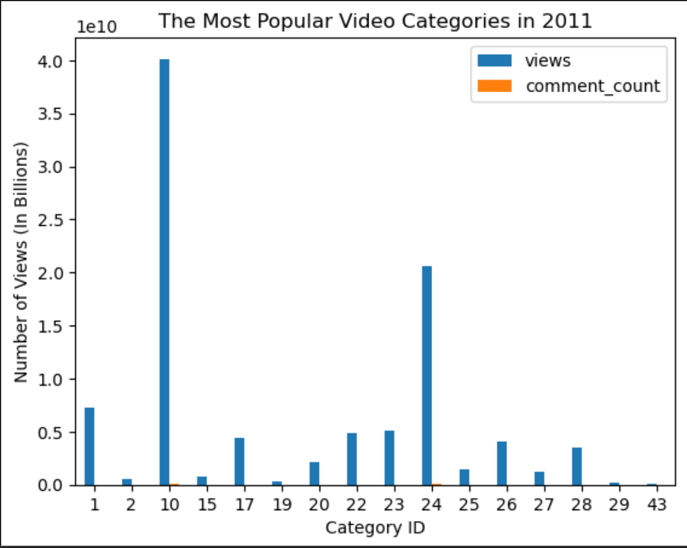

## Youtube Analytics between Nov 2017 and June 2018 in the U.S.

YouTube is a popular online video-sharing platform that allows users to upload, watch, and share videos on a wide range of topics, from entertainment and education to news and tutorials, while also providing a platform for creators to build an audience and monetize their content through ads and sponsorships.
Analyzing YouTube video viewership is important for evaluating content performance, understanding the audience, optimizing content, monetization, competitor analysis, and making informed decisions. It helps creators and businesses maximize their reach, engagement, and overall success on the YouTube platform.

## The Most Popular Creators between Nov 2017 and June 2018 and Their View Count

## The Most Popular Video Categories by View Count

## Planning

Group Presentation Pandas EDA Project

ToDo 27 JUN 23
X-Change title of chart to reflect 2017-2018 date range
-ID most popular videos 
-Add category type to numeric values from JSON file
-4. Most trending Tags (pull strings from data with PIPE) -> create a function
-5. Add new correlation between when the video was published and when it started trending

Overview

Change graph titles, where it says 2011.. Dataset is actually between Nov 2017 through June 2018. 

1. Finding the most popular creator by common channel title (which handle, what's trending) ======== Found it. Done
   Like, dislike ratio
2. Most popular category ID

3. Trending "video ID" analysis (most common video on the trend list)

4. Most trending Tags (pull strings from data with PIPE) -> create a function

5. Add new correlation between when the video was published and when it started trending

bonus. Trending duration (spikes)
bonus. identify social media links in description

#1 Film & Animation
2 Autos & Vehicles
10 Music
15 Pets & Animals
17 Sports
18 Short Movies
19 Travel & Events
20 Gaming
21 Videoblogging
22 People & Blogs
23 Comedy
24 Entertainment
25 News & Politics
26 Howto & Style
27 Education
28 Science & Technology
29 Nonprofits & Activism
30 Movies
31 Anime/Animation
32 Action/Adventure
33 Classics
34 Comedy
35 Documentary
36 Drama
37 Family
38 Foreign
39 Horror
40 Sci-Fi/Fantasy
41 Thriller
42 Shorts
43 Shows
44 Trailers
